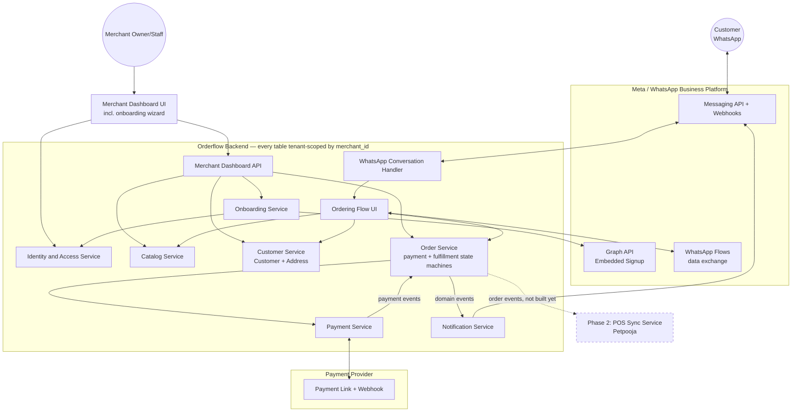
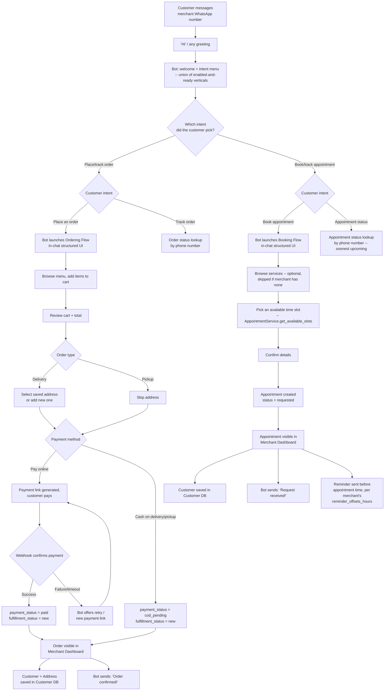

# Orderflow — System Architecture (MVP)

This document describes the system architecture for the WhatsApp Commerce Platform MVP, as scoped in `docs/project-brief.txt`. It is stack-agnostic — no language, framework, or vendor SDK is prescribed. The goal is a design simple enough to build and pilot with 1-2 real restaurants, while staying multi-tenant-safe from day one and keeping the Order model open to a Phase 2 POS sync (Petpooja) without restructuring.

> **Update note (this revision):** adds full merchant onboarding (register → login → Meta/WhatsApp connection → kitchen details → menu), a concrete customer ordering experience (in-chat structured "mini UI" browse/cart/checkout, WhatsApp-Flow-style — the Bangalore Metro-ticket-booking pattern), Cash-on-Delivery as a second payment path alongside the online payment link, and a first-class Customer/Address record. These go beyond what `docs/project-brief.txt` spells out line-by-line — see **Section 11: Deviations from the original brief** for exactly what's new vs. what's just detail added to something the brief left vague.
>
> **Update note (multi-vertical revision):** a merchant belongs to one or both of two verticals — `restaurant` (this document's original subject) or `appointment` (general-purpose service booking: salons, clinics, consultants). Every merchant-facing surface branches on which are enabled: the WhatsApp intent menu (Section 6, Section 9c), the dashboard nav and catalog-equivalent page, and the onboarding wizard (Section 5, Section 9b). The "Talk to us" / "Talk to restaurant" handoff intent is removed entirely, for every vertical, not conditionally. See `MULTI_VERTICAL_PLAN.md` for the phased implementation this shipped under.
>
> **Update note (vertical-toggle revision):** superseded that revision's "exactly one, immutable" rule — a merchant now picks one or both verticals upfront in the onboarding wizard (a multi-select, not two mutually-exclusive cards) and can add the other later from Settings, no re-registration or admin intervention needed (`Merchant.restaurant_enabled`/`appointment_enabled`, Section 1, replacing the single `vertical` enum column). The one rule that survived: a vertical that's enabled but has zero available items/active services behind it is never shown to a WhatsApp customer (Section 6) or counted as ready during onboarding (Section 5) — same "don't show an empty flow" principle, now enforced per-vertical rather than only for restaurant. See `VERTICAL_TOGGLE_PLAN.md` for the phased implementation this shipped under.

---

## 1. Core entities / data model

### Merchant (tenant root)
Every other tenant-scoped table traces back to a `merchant_id`. This is the tenancy boundary — see Section 2.
- `merchant_id` (PK)
- `business_name`, `legal_name` (optional)
- `owner_contact` (phone/email used at registration)
- `restaurant_enabled`, `appointment_enabled` (booleans, not-both-false invariant) — a merchant can run either or both verticals. Set via the onboarding wizard's first step (multi-select), and freely editable afterwards from Settings' "Business types" section (add a second vertical any time — same endpoint, same validation, no immutability guard). Together they gate every merchant-facing surface: the WhatsApp intent menu is additive per enabled-and-ready vertical (Section 6/9c), the dashboard nav shows the catalog-equivalent page for each enabled vertical (Catalog for restaurant, Services for appointment — both at once when both are enabled), and which onboarding steps appear (Section 5/9b). Superseded Phase 10's single `vertical` enum column (VERTICAL_TOGGLE_PLAN.md) — that column no longer exists.
- `onboarding_status` — see Section 5 state machine
- business details: `business_address_line1`/`business_address_line2`/`business_city`/`business_pincode`, `business_category`, `license_no` (optional)
- `status` (active / inactive / suspended)
- `created_at` / `updated_at`

### StaffUser (Merchant's login identity)
- `staff_user_id`, `merchant_id` (FK, tenant scope)
- `name`, `email_or_phone`, `password_hash` (or auth-provider ref)
- `role` (single implicit "owner/staff" role for MVP — field reserved for future differentiation, not enforced yet, per brief's explicit exclusion of multi-user roles)
- `last_login_at`, `created_at`

### WhatsAppBusinessAccount (one per Merchant, MVP single-outlet assumption)
Created during onboarding's "Meta token setup" + "WhatsApp account setup" steps.
- `waba_id` (PK, internal)
- `merchant_id` (FK, unique)
- `meta_waba_id`, `phone_number_id`, `display_phone_number` (Meta-side identifiers)
- `access_token_encrypted` (encrypted at rest — see Section 10)
- `token_expiry_at` (nullable)
- `connection_status` (`pending`, `connected`, `token_expired`, `disconnected`)
- `webhook_subscribed` (bool)
- `connected_at`

### Item
- `item_id`, `merchant_id` (FK)
- `category`, `name`, `price`, `is_available`
- `external_pos_item_id` (nullable — Phase 2 seam, unused now)
- `created_at` / `updated_at`

### Customer
- `customer_id`, `merchant_id` (FK — customers are scoped per merchant, not global)
- `whatsapp_number` (unique together with `merchant_id`)
- `display_name`, `first_seen_at`, `last_order_at`

### Address
New in this revision — needed because delivery orders and the merchant-side "customer database" both require it.
- `address_id`, `customer_id` (FK), `merchant_id` (FK, denormalized for tenant-scoped queries)
- `label` (Home/Work/Other), `line1`, `line2`, `landmark`, `city`, `pincode`, `geo_lat`/`geo_long` (optional)
- `is_default`, `created_at`

### Order
Central entity, kept POS-integration-friendly (Phase 2 seam fields below) and — new in this revision — with **payment status and fulfillment status split into two independent fields**. This split exists because Cash-on-Delivery orders need to enter the kitchen workflow immediately without ever going through the payment gateway, so "has the customer paid" and "where is the kitchen at" can no longer be the same enum.
- `order_id`, `merchant_id` (FK), `customer_id` (FK)
- `order_type` (`pickup` | `delivery`) — new; determines whether `delivery_address_id` is required
- `delivery_address_id` (nullable FK to `Address`; required if `order_type = delivery`)
- `payment_method` (`online` | `cod`) — new
- `payment_status` — see Section 7a
- `fulfillment_status` — see Section 7b
- `subtotal`, `total`, `currency`
- `whatsapp_conversation_ref` (ties the order back to the chat thread for outbound notifications)
- `external_pos_order_id` (nullable — Phase 2 seam, unused now)
- `placed_at`, `paid_at` (nullable, online only), `ready_at`, `completed_at`
- `created_at` / `updated_at`

### OrderItem
- `order_item_id`, `order_id` (FK), `item_id` (FK, traceability)
- `name_snapshot`, `price_snapshot`, `quantity`, `line_total`

### PaymentEvent
Append-only log — the source of truth for payment state, `Order.payment_status` is a derived/materialized view over it. Covers both online and COD so there's one auditable trail either way.
- `payment_event_id`, `order_id` (FK)
- `provider` (`razorpay` | `cod`)
- `provider_payment_id` / `provider_order_id` (nullable for COD)
- `event_type` (`link_created`, `payment_succeeded`, `payment_failed`, `webhook_received_duplicate`, `cod_selected`, `cod_collected`)
- `raw_payload` (raw webhook body where applicable)
- `recorded_by` (`system` for webhook-driven events, a `staff_user_id` for the `cod_collected` event a staff member confirms at handover)
- `received_at`

### OrderStatusEvent
Append-only audit trail of `fulfillment_status` transitions only (payment transitions live in `PaymentEvent`).
- `status_event_id`, `order_id` (FK)
- `from_status`, `to_status`
- `changed_by` (`staff_user_id`, or `"system"` — e.g. Phase 2 POS pushing a status back)
- `notified_customer` (bool)
- `changed_at`

**Why this shape survives Phase 2 POS sync:** `Order` and `Item` each carry a nullable `external_pos_*_id`. `OrderStatusEvent.changed_by` already accepts a system actor, so a future POS webhook pushing "Processing" is the same code path a staff tap uses today. Nothing needs renaming to add Phase 2.

---

## 2. Multi-tenancy model

Chosen approach for MVP scale (1-2 pilot restaurants, growing to more single-outlet merchants — not enterprise multi-outlet chains, per brief): **shared database, shared schema, row-level tenant scoping** via `merchant_id` on every tenant-owned table, with `Merchant` as the tenant root. Schema-per-tenant or database-per-tenant is unnecessary operational overhead at this scale; the design below keeps the door open to graduate a specific tenant later without a rewrite.

Enforcement is structural, not a convention every engineer has to remember:

- **Tenant context resolved once, early, per request.** Dashboard API requests resolve `merchant_id` from the authenticated `StaffUser`'s session via middleware before any handler runs. WhatsApp inbound webhooks resolve `merchant_id` by looking up Meta's `phone_number_id` against `WhatsAppBusinessAccount` — this lookup is the *first* thing the Conversation Handler does with any inbound message, before any other component sees it. Payment webhooks resolve tenant from the `order_id`/`provider_order_id` recorded at link-creation time — never from a tenant field the provider might echo back.
- **Repository pattern carries the tenant context, not the caller.** No repository method exists that can fetch or mutate a row without a `TenantContext` argument (see Section 4) — this makes a cross-tenant data leak an interface-level mistake, not just something code review has to catch.
- **Explicitly deferred**, since no current pilot need justifies it yet: per-tenant rate limiting, per-tenant data export/residency tooling, tenant-level feature flags.

---

## 3. System components

| Component | Owns | Does NOT own |
|---|---|---|
| **Identity & Access Service** | Merchant registration, `StaffUser` credentials/login, session/token issuance, resolving `TenantContext` | Onboarding progress beyond account creation itself |
| **Onboarding Service** | `Merchant.onboarding_status` state machine; Meta embedded-signup/token exchange; creates & updates `WhatsAppBusinessAccount` | Runtime chat handling, catalog content (delegates to Catalog Service for the menu step) |
| **WhatsApp Conversation Handler** | Runtime chat orchestration: greeting, intent routing, launching the Ordering Flow UI, resolving tenant from `phone_number_id` | Menu data, order/payment logic, customer/address persistence — all delegated |
| **Ordering Flow UI** (WhatsApp Flow or embedded webview — see Section 6) | The in-chat structured browse → cart → checkout experience and its data-exchange endpoint | Business rules — it calls Catalog/Customer/Order Service for everything, doesn't decide validity itself |
| **Catalog Service** | `Item` CRUD, availability | Pricing at order time (snapshotted by Order Service into `OrderItem`) |
| **Customer Service** | `Customer` and `Address` CRUD — the "customer database" the merchant sees | Order history logic (Order Service owns that; Customer Service just serves profile/address lookups) |
| **Order Service** | `Order`/`OrderItem` lifecycle, both state machines (Section 7), the only writer of `payment_status`/`fulfillment_status` | Talking to the payment provider or WhatsApp directly — reacts to Payment Service outcomes, delegates outbound messages to Notification Service |
| **Payment Service** | Payment-link creation, webhook verification, idempotent `PaymentEvent` writes (online); recording `cod_selected`/`cod_collected` events (COD) | Deciding what happens to the order after a payment event — emits the fact, Order Service reacts |
| **Notification Service** | Outbound WhatsApp messages triggered by order/payment events | Conversation state (one-way outbound only) |
| **Merchant Dashboard API** | Authenticated endpoints over Order/Catalog/Customer/Onboarding services | No business logic of its own — delegates all writes so state machines stay centralized |
| **Merchant Dashboard UI** (web) | Orders list/detail, catalog management, onboarding wizard, customer/address views | Talks only to Dashboard API |

---

## 4. Design patterns & code quality standards

Stack-agnostic, but these are the structural patterns any implementation should follow — chosen specifically because they're what makes the Phase 2 POS seam, multi-tenancy, and the COD/online payment split actually hold up in code rather than degrading into special-casing.

**Backend**
- **Hexagonal / ports-and-adapters.** The domain core (entities, the two `Order` state machines, business rules) depends only on interfaces: `PaymentGateway`, `NotificationChannel`, `OrderingSurface`, `Repository`. WhatsApp, Razorpay, and the database are all adapters plugged into those ports — swapping a BSP or payment provider, or adding Phase 2 POS, means writing a new adapter, not touching domain logic.
- **Repository pattern**, one per aggregate root (`OrderRepository`, `MerchantRepository`, `CustomerRepository`), always tenant-scoped (Section 2). Domain/service code never issues raw queries.
- **Strategy pattern** for anything with more than one implementation today or foreseeably: `PaymentGateway` (Razorpay now), `NotificationChannel` (WhatsApp now), `OrderingSurface` (WhatsApp Flow vs. webview — same Order Service underneath, different delivery mechanism).
- **Explicit finite state machines**, not scattered conditionals, for `Order.payment_status`, `Order.fulfillment_status`, and `Merchant.onboarding_status` — each defined as a single allowed-transitions table with guard conditions, and unit-testable in isolation.
- **Domain events (pub-sub/observer).** Order Service publishes events (`OrderPaid`, `OrderConfirmedCOD`, `OrderReady`, `OrderCompleted`); Notification Service and (Phase 2) POS Sync Service subscribe. Producers don't know who's listening — that's what makes Phase 2 "add a subscriber," not "modify Order Service."
- **Middleware/interceptor** for cross-cutting concerns: tenant-context + auth resolution on every Dashboard API request, webhook signature verification + idempotency check on every Payment Service inbound call, correlation IDs for tracing one customer's chat session across services.
- **Lightweight CQRS**: dashboard reads (orders list, daily totals) are simple read-optimized queries; every write goes through the owning domain service so state-machine rules can't be bypassed from a UI shortcut.

**Frontend (Merchant Dashboard UI)**
- **Feature-sliced structure** (group by feature — orders, catalog, onboarding, customers — not by technical layer).
- **Container/presentational split**: data-fetching and mutation logic in containers; presentational components (e.g. an `OrderCard`) stay pure and don't know how a status update gets persisted.
- **Cache-and-revalidate data fetching** for the orders list (short-interval polling/revalidation) — meets the "visible within seconds" requirement without websocket infrastructure.
- **Wizard/stepper pattern for onboarding**, driven by `Merchant.onboarding_status` from the backend as the single source of truth, so resuming onboarding on a different device/session lands on the correct step instead of the UI tracking its own duplicate progress.
- **Shared component/design system** across the onboarding wizard and the day-to-day dashboard so the two don't visually or behaviorally diverge.
- **Optimistic UI updates** for status-transition taps, reconciled against the server response — improves perceived speed without weakening the server-side state machine as the actual authority.

---

## 5. Merchant onboarding — flow & state machine

`Merchant.onboarding_status` values, strictly linear for MVP (no step-skipping) — one status table regardless of which vertical(s) a merchant selects, since `catalog_ready`'s *gate condition* (not the status itself) is what varies:

`registered → vertical_selected → meta_connected → whatsapp_verified → profile_completed → catalog_ready → live`

| Status | Reached when | Owned by |
|---|---|---|
| `registered` | Owner submits business name + contact + password; Identity & Access Service creates `Merchant` + owner `StaffUser` | Identity & Access Service |
| `vertical_selected` | Owner picks one or both of restaurant/appointment (the wizard's multi-select first step) — freely re-editable later from Settings, not one-time | Onboarding Service (writes `Merchant.restaurant_enabled`/`appointment_enabled`) |
| `meta_connected` | Meta embedded signup / token exchange completes; `WhatsAppBusinessAccount` row created with encrypted token | Onboarding Service |
| `whatsapp_verified` | Phone number verified and webhook subscription confirmed (`connection_status = connected`) | Onboarding Service |
| `profile_completed` | Business details saved (address, business/service category, license number optional) on `Merchant` — the category options and field labels shown to the owner branch by which vertical(s) are enabled, though the columns themselves are vertical-neutral. The wizard shows one setup step per enabled vertical here (restaurant's "add an item" then appointment's "add a service", in that fixed order when both are picked) | Onboarding Service (writes to Merchant) |
| `catalog_ready` | Every *enabled* vertical's own readiness gate is satisfied: restaurant needs ≥1 available `Item`, appointment needs ≥1 active `AppointmentService` — a vertical that isn't enabled trivially satisfies its own half. Both gates are now required-if-enabled (an appointment vertical with zero services no longer cascades through for free — see the "empty flow" note in Section 6) | Catalog Service / Appointment Service supply the data; Onboarding Service checks the combined gate |
| `live` | All above complete | Onboarding Service — this is the gate the Conversation Handler checks before treating inbound chats as order-/booking-capable |

Adding a vertical **after** a merchant is already `live` (via Settings, not the wizard) doesn't touch `onboarding_status` at all — there's no "re-enter onboarding" detour. The new vertical's Catalog/Services page and dashboard nav tab appear immediately; the WhatsApp menu simply won't offer it until its own readiness gate is met, enforced by the same check the Conversation Handler already runs on every inbound message (Section 6).

See the flow diagram in Section 9.

---

## 6. Customer WhatsApp ordering — flow & sequence

This section documents the **restaurant vertical's** flow in detail (it predates the appointment vertical). The **appointment vertical** follows the same shape — greet → intent menu → structured in-chat Flow → confirmation → status lookup — via the `appointment_flow`/`flows` modules' `AppointmentService`/`Appointment`/`MerchantAvailability` entities instead of `Item`/`Order`; see Section 9c's diagram for both branches side by side. The intent menu is **additive, not exclusive**: it offers each enabled vertical's two options (place/track or book/track) plus FAQs if configured, so a merchant running both verticals shows all four at once — but only once that vertical is *ready*, not merely enabled. An enabled vertical with zero available items/active services is silently omitted from the menu (and its own PLACE_ORDER/BOOK_APPOINTMENT intent falls through to the greeting menu, same as an unrecognized message) — the "don't show an empty flow to a customer" guard, checked fresh on every inbound message rather than cached anywhere. "Talk to us" was removed for every vertical and never comes back.

### The "mini UI inside the chat"
The Bangalore-Metro-ticket-booking-style experience you referenced is best implemented as a **WhatsApp Flow** — Meta's native structured, multi-screen in-chat UI (JSON-driven forms/screens rendered inside WhatsApp itself, no app-switch, higher completion rates than a link-out). The architecture treats this as one implementation of the `OrderingSurface` strategy interface (Section 4); an external webview link is the fallback strategy if the chosen BSP doesn't support Flows well. Either way, Order Service and Catalog Service are unaware which surface is in use — they just receive a cart/checkout payload.

### Sequence (happy path, both payment methods)
1. **Customer** messages the merchant's WhatsApp number — first contact or "hi".
2. **Conversation Handler** resolves tenant via `phone_number_id`, resolves/creates the `Customer` record (via Customer Service), greets, and presents an intent menu -- Place order / Track order for the restaurant vertical if it's enabled and ready, Book appointment / Appointment status for the appointment vertical if it's enabled and ready, both pairs at once for a merchant running both, plus FAQs if configured; never a "Talk to us" handoff (removed for every vertical).
3. Customer picks **Place order** → Handler launches the **Ordering Flow UI**.
4. Ordering Flow UI calls **Catalog Service** for categories/items (`is_available = true`), customer browses and builds a cart client-side within the Flow.
5. Customer reviews cart + total, picks **order type**: pickup, or delivery (if delivery: select a saved **Address** via Customer Service, or add a new one).
6. Customer picks **payment method**:
   - **Online**: Ordering Flow hands the cart to **Order Service**, which creates the `Order` (`payment_status = awaiting_payment`), then calls **Payment Service** to create a Razorpay link. Handler sends the link in-chat. Customer pays; provider webhook (or reconciliation poll, see Section 8) confirms → `payment_status = paid`, `fulfillment_status = new`.
   - **COD**: Ordering Flow hands the cart to Order Service, which creates the `Order` directly with `payment_status = cod_pending`, `fulfillment_status = new` — no gateway round trip, order is immediately actionable by the kitchen.
7. Either branch: **Order Service** publishes an `OrderConfirmed`-class domain event → **Notification Service** sends *"Order confirmed! We'll let you know when it's ready."*
8. Order (with items, customer, and address if applicable) is now visible in **Merchant Dashboard UI**, and the `Customer`/`Address` records are persisted for future orders (repeat customers reuse saved addresses).
9. Staff advances `fulfillment_status` (`new → processing → ready → completed`) from the dashboard; per brief, the `ready` transition (minimum) triggers a WhatsApp message back to the customer. For **COD orders**, staff marks `cod_collected` (a `PaymentEvent`) at handover — this is manual and does not block fulfillment progress.

### Failure paths (see also Section 8)
- **Online payment fails/abandoned**: `payment_status → payment_failed` (webhook) or times out and is swept to `cancelled` (no webhook at all, background job) — order never reaches the kitchen.
- **Webhook late/missing for an online payment**: reconciliation poll against the provider closes the gap (Section 8) — the order isn't lost, just delayed in reaching `paid`.
- **COD has no "payment failure" path by construction** — the risk profile is different (no-show/non-payment at handover is a staff/business-process problem, not a system-reliability one); this is a deliberate simplification, see Section 11.

See the flow diagram in Section 9.

---

## 7. Order state machines

### 7a. `payment_status`

| Transition | Trigger | Notifies customer? |
|---|---|---|
| `— → awaiting_payment` | Online payment link generated | No (the link message itself is the notification) |
| `awaiting_payment → paid` | Payment webhook confirmed / reconciliation confirms | **Yes** — "Order confirmed!" (brief: required) |
| `awaiting_payment → payment_failed` | Payment webhook reports failure | Recommended |
| `payment_failed → awaiting_payment` | Customer retries, new link generated | No |
| `awaiting_payment → cancelled` *(terminal, mirrored onto `fulfillment_status`)* | Timeout sweep, no activity | No |
| `— → cod_pending` | COD selected at checkout | **Yes** — "Order confirmed!" (same as online-paid, brief requires confirmation regardless of method) |
| `cod_pending → cod_collected` | Staff confirms cash received at handover | No |

Only `Payment Service`-verified events (or a staff tap for `cod_collected`) may move this field — never a client-side "I paid" signal from the chat.

### 7b. `fulfillment_status`

`new → processing → ready → completed`, plus `* → cancelled` (staff-initiated, any point before `completed`).

Gate: `fulfillment_status` starts at `new` the moment `payment_status` reaches `paid` **or** `cod_pending` — i.e. as soon as the order is either paid online or the customer has committed to COD. This is the one place the two state machines interact.

| Transition | Trigger | Notifies customer? |
|---|---|---|
| `(none) → new` | `payment_status` reaches `paid` or `cod_pending` | Covered by the payment-side "Order confirmed!" above |
| `new → processing` | Staff taps in dashboard | Optional |
| `processing → ready` | Staff taps in dashboard | **Yes** — brief: minimum required |
| `ready → completed` | Staff taps in dashboard | Recommended (brief says "at minimum Ready/Completed" — see Section 11 open question) |
| `* → cancelled` | Staff cancels | Recommended |

Order Service is the only writer of both fields and rejects any transition not in these tables.

---

## 8. Integration boundaries

**WhatsApp Business Platform (Meta)** — two distinct API surfaces, used by different components:
- *Setup-time*: Graph API / embedded signup, used only by **Onboarding Service** to connect a merchant's WhatsApp Business Account and obtain a long-lived token.
- *Runtime*: Messaging API + webhooks (inbound chat) and WhatsApp Flows data-exchange, used by **Conversation Handler**, **Ordering Flow UI**, and **Notification Service**. Inbound webhooks are at-least-once — dedupe by WhatsApp message ID.
- Status/template-message policy (messages outside the customer-initiated 24-hour window may require pre-approved templates) is a real external constraint — flagged in Section 11, needs verifying against the chosen BSP.

**Payment provider (Razorpay or similar)** — only **Payment Service** talks to it.
- Payment-link creation: sync call, online orders only.
- Webhook confirmation: async, signature-verified, idempotent via `PaymentEvent` keyed on `provider_payment_id` — a webhook replay is logged as `webhook_received_duplicate` and no-ops on `Order`.
- Reconciliation: scheduled poll against the provider's payment-status API for orders stuck in `awaiting_payment` past a threshold — the safety net for missed webhooks (Section 10).
- **COD bypasses this integration entirely** — `provider = "cod"` in `PaymentEvent` exists only for audit symmetry, no external call is made.

**Phase 2 seam — POS integration (Petpooja, later UrbanPiper).** Not built now. A future **POS Sync Service** subscribes to the same domain events Notification Service already consumes; on `OrderConfirmed`-class events it pushes the order to Petpooja's order-injection API and stores the id in `Order.external_pos_order_id`. Reverse-direction status pushes from Petpooja would call Order Service's existing transition path with `changed_by = "system:petpooja"`. Additive only — no migration needed, per the seam fields already in Section 1.

Note this is a **restaurant-vertical-specific optional integration**, not a universal Phase 2 assumption for every merchant on the platform: Petpooja/UrbanPiper are food-service POS/KDS systems, so this seam only matters for restaurant tenants that use one. A non-restaurant vertical has no equivalent Phase 2 obligation — the seam fields (`external_pos_*_id`) simply stay unused for those tenants, same as they do for any restaurant that hasn't adopted a POS.

---

## 9. Diagrams

### 9a. System architecture



### 9b. Merchant onboarding flow

Business types can also be added later from Settings, using the exact same `PUT /verticals` step 1 uses — not shown separately below since it's the identical write, just triggered outside the wizard, and it doesn't touch `onboarding_status` at all when the merchant is already `live`.

```mermaid
flowchart TD
    A[Owner visits signup] --> B[Register: business name + owner contact + password]
    B --> D[Login]
    D --> V["Wizard Step 1: Pick business type(s)<br/>restaurant and/or appointment -- multi-select,<br/>freely editable later from Settings"]
    V --> E[Step 2: Connect Meta / WhatsApp Business]
    E --> F[Meta embedded signup / token exchange]
    F --> G{Token + WABA received?}
    G -- No --> F
    G -- Yes --> H[Store WhatsAppBusinessAccount<br/>access_token encrypted]
    H --> I[Step 3: Verify WhatsApp number<br/>+ subscribe webhook]
    I --> J{Verified?}
    J -- No --> I
    J -- Yes --> K[Step 4: Business details<br/>address, category, license optional --<br/>labels branch by which type(s) are enabled]
    K --> L1{Restaurant enabled?}
    L1 -- Yes --> M1[Step 5: Menu and pricing<br/>add categories + items]
    M1 --> N1{At least 1 available item?}
    N1 -- No --> M1
    N1 -- Yes --> L2
    L1 -- No --> L2{Appointment enabled?}
    L2 -- Yes --> M2[Step 6: Services<br/>add a bookable service type]
    M2 --> N2{At least 1 active service?}
    N2 -- No --> M2
    N2 -- Yes --> P[Merchant.onboarding_status = live]
    L2 -- No --> P
    P --> O[Dashboard fully unlocked,<br/>ready to receive customer orders/bookings<br/>for every enabled, ready vertical]
```

### 9c. Customer order-placement flow (WhatsApp)

Two branches off the intent-menu node, one per vertical -- **additive, not exclusive**: the menu itself offers whichever of the two branches below are both enabled and ready (zero available items/services = that branch is omitted even if enabled, the "no empty flow" guard) -- a merchant running both verticals shows a customer all four options at once, never a "Talk to us" handoff (removed from both):



---

## 10. Non-functional considerations

**Must be reliable:**
- Online payment confirmation must never be lost or double-applied — the append-only `PaymentEvent` log, idempotency key check, and reconciliation poll (Section 8) exist for this specifically.
- The `paid` transition must be atomic under concurrent duplicate webhooks.
- An order must appear in the merchant dashboard within seconds of `payment_status` reaching `paid` or `cod_pending` — implies near-real-time polling/revalidation on the dashboard, not batch refresh.
- The Meta access token in `WhatsAppBusinessAccount.access_token_encrypted` is a sensitive, high-blast-radius credential (controls the merchant's WhatsApp number) — must be encrypted at rest, never logged, and rotated/handled per Meta's token-expiry model.

**Can be simple/manual for now:**
- `fulfillment_status` advancement is explicitly manual, staff-tapped.
- `cod_collected` confirmation is trust-based/manual — no reconciliation machinery for COD, unlike online payments.
- No multi-user roles/permissions.
- No retry/backoff sophistication for outbound WhatsApp notification sends beyond "try, log failure."
- Single-outlet per merchant throughout — one `WhatsAppBusinessAccount` per `Merchant`.

**Idempotency / webhook-retry concerns:**
- Payment and WhatsApp webhooks can both redeliver — persist-raw-payload-then-process (write-ack pattern), dedupe by provider/message ID, never "last write wins" on timestamp.
- The reconciliation poll and the webhook path converge on the same "record event, ask Order Service to transition" code path — one mutation path regardless of trigger.

---

## 11. Open questions, assumptions & deviations from the original brief

**Deviations from `docs/project-brief.txt`** (flagging per your instruction — these go beyond what the brief specified):
1. **Cash-on-Delivery is new.** The brief only specifies "UPI/Razorpay payment link... webhook confirms payment." Adding COD doesn't violate the brief's success criterion ("no restaurant staff manual intervention needed to *take* the order" — COD still requires zero staff intervention to place the order, only to collect cash at handover), but it does mean the "payment confirmation must never be lost" reliability guarantee (brief-adjacent, Section 10) **only applies to the online path** — COD has no equivalent system-level guarantee by design. Confirm this trade-off is acceptable for the pilot.
2. **Delivery + Address is new.** The brief's flows describe pickup-style fulfillment only ("order ready," staff hands it over) with no mention of delivery logistics. This design adds `order_type` and `Address` for **data capture only** — it does **not** add rider assignment, delivery tracking, or route/logistics management, which stay out of scope per the brief's spirit. If delivery logistics are actually needed for the pilot, that's a bigger scope conversation.
3. **Merchant onboarding (register → login → Meta token → WhatsApp setup → kitchen details → menu) is newly detailed**, not a deviation — the brief only had one line ("Restaurant sets up their menu/catalog once... inside our merchant app"). This fills in an area the brief left unspecified.
4. **The in-chat "mini UI" (WhatsApp Flow) is a concrete choice**, not a deviation — the brief already allowed "WhatsApp catalog/cart or a simple guided chat flow." Worth confirming the chosen BSP actually supports WhatsApp Flows well before committing, since not all do equally (fallback: webview link, per Section 6).
5. **The appointment-booking vertical is realizing an explicit brief statement**, not a deviation — Section 7's exclusions list names "a specific non-restaurant vertical" as out of scope for the pilot while adding "the underlying platform is vertical-agnostic by design, not restaurant-locked." `Merchant.restaurant_enabled`/`appointment_enabled` (Section 1) is that design intent made concrete: exactly two verticals for now (a third would be a visible schema change, not silently supported), and — since VERTICAL_TOGGLE_PLAN.md — a merchant can run either or both, chosen upfront or added later from Settings, rather than being locked into exactly one at registration.

**Assumptions:**
5. Customers are scoped per-merchant (`merchant_id` + `whatsapp_number` unique), not a global identity across restaurants.
6. Abandoned online-payment orders need a timeout/expiry sweep — duration not specified by the brief. **Needs a decision**: e.g. 30 min vs 2 hours.
7. Both `processing→ready` and `ready→completed` are modeled as capable of notifying the customer; brief says "at minimum Ready/Completed" without fully disambiguating. **Needs a decision**: notify on both or just one.
8. Single currency, no tax/discount modeling — `subtotal`/`total` are equal for MVP, kept separate only so tax logic has somewhere to go later.
9. `Merchant Dashboard UI` and `Merchant Dashboard API` are one web app (brief confirms responsive web is sufficient, no native app).

**Not addressed by design** (explicitly out of scope per brief, intentionally absent): POS/KDS auto-sync, loyalty/broadcast marketing, multi-outlet management, multi-user roles/permissions, free-text AI ordering, delivery logistics/rider tracking (per deviation #2 above).
